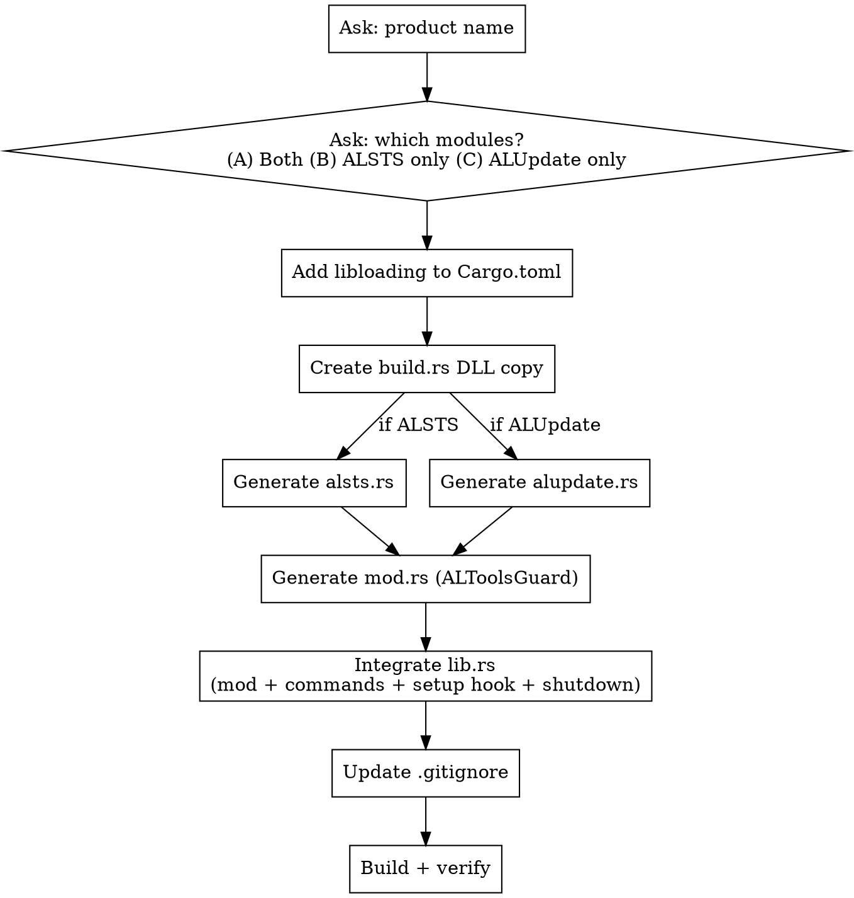

# ALTools DLL Tauri Integration

Integrate ESTsoft shared modules (ALSTS, ALUpdate) into a Tauri v2 Rust backend using libloading.

## Process



## Step 1: Gather Inputs

Ask the user:
1. **Product name** — string passed to `ALSTS_Initialize`/`ALUpdate_Init` (e.g., "ALDodok")
2. **Module selection** — (A) ALSTS + ALUpdate, (B) ALSTS only, (C) ALUpdate only
3. **DLL file locations** — where the DLL files are on disk

## ALSTS DLL Export Functions

**DLL:** `ALSTS_x64.dll` | **Calling convention:** `__stdcall` | **Charset:** MultiByte (`LPCTSTR` = `const char*`)

- **`ALSTS_Initialize`** (@1) — `BOOL (LPCTSTR productName)`
  Initialize statistics collection under default company (ESTSoft). Launches Collector immediately and starts a periodic timer that flushes accumulated counts to registry. **Must call at app startup.** Safe to call multiple times (returns TRUE if already initialized).

- **`ALSTS_InitializeEx`** (@4) — `BOOL (LPCTSTR productName, LPCTSTR companyName)`
  Same as Initialize, but overrides company name in registry paths (`Software\{companyName}\{productName}\ALSTS\`). Use when shipping under a non-ESTSoft brand.

- **`ALSTS_ExecuteAction`** (@3) — `BOOL (LPCTSTR actionID)`
  Increments in-memory count for actionID by 1 (thread-safe). Registry flush happens on the periodic timer, not immediately. Returns FALSE if not initialized.

- **`ALSTS_Finalize`** (@2) — `VOID ()`
  Stops timer, flushes remaining counts to registry, releases resources. **Must call at app shutdown.** No-op if not initialized.

## ALSTS Action ID Convention

Format: `{product}_{version}_{sequence}`

- **product**: short product name (e.g., `dodok`, `pen`)
- **version**: version number with dots removed (e.g., 1.0 → `100`, 2.1 → `210`)
- **sequence**: 3-digit ordinal within that version (e.g., `001`, `002`, ...)

Examples: `dodok_100_001`, `pen_100_017`

## ALUpdate DLL Export Functions

**DLL:** `ALUpdate_x64.dll` | **Calling convention:** `__stdcall` | **Charset:** MultiByte (`const char*`)

- **`ALUpdate_Init`** (@1) — `long (const char* productName)`
  Initialize update module. Saves run count, checks mandatory files, handles self-update if pending, and triggers immediate update if due. **Must call at app startup.** Returns non-zero on success.

- **`ALUpdate_UpdateProduct`** (@2) — `BOOL (const char* productName)`
  Manually trigger update check and installation. Use for user-initiated "Check for Updates" action.

- **`ALUpdate_Exit`** (@3) — `void (const char* productName)`
  Finalize update module. Handles pending self-updates and triggers deferred updates if due. **Must call at app shutdown.**

- **`ALUpdate_CheckEULA`** (@4) — `void (const char* productName)`
  Launch EULA check process (once per day). Actual version comparison and dialog are handled by the external ALUpdate executable.

## Step 2: Cargo.toml + build.rs

### Cargo.toml

Add to `[dependencies]`:

```toml
libloading = "0.8"
```

### build.rs

Place DLLs in `src-tauri/dlls/`. The build script copies them to the build output directory.

```rust
use std::path::Path;

fn main() {
    tauri_build::build();

    let out_dir = std::env::var("OUT_DIR").unwrap();
    // Why nth(3): OUT_DIR is target/{profile}/build/{pkg}-{hash}/out.
    // Note: --target cross-compilation changes the layout. Windows native build only.
    let target_dir = Path::new(&out_dir)
        .ancestors()
        .nth(3)
        .expect("failed to resolve target dir");

    let dlls_dir = Path::new("dlls");
    for dll_name in [/* selected DLL names */] {
        let src = dlls_dir.join(dll_name);
        if src.exists() {
            let dst = target_dir.join(dll_name);
            std::fs::copy(&src, &dst).unwrap_or_else(|e| {
                println!("cargo:warning=Failed to copy {dll_name}: {e}");
                0
            });
        } else {
            println!("cargo:warning={dll_name} not found in dlls/");
        }
        println!("cargo:rerun-if-changed=dlls/{dll_name}");
    }
}
```

### .gitignore

```gitignore
src-tauri/dlls/*.dll
```

## Step 3: Generate Code

### Critical Patterns — DO NOT DEVIATE

These patterns are non-obvious and verified correct. Deviating causes UB or memory leaks.

#### Pattern 1: Symbol lifetime + drop ordering

```rust
pub struct DllWrapper {
    // Symbol fields MUST be declared BEFORE _lib.
    // Rust drops struct fields in declaration order (RFC 1857).
    // Symbol must drop before Library to prevent dangling pointer.
    some_fn: Symbol<'static, unsafe extern "C" fn() -> bool>,
    _lib: Library,
}
```

The `'static` lifetime is obtained via `std::mem::transmute`. Safety is guaranteed by drop ordering — Symbol is always dropped before Library within the same struct.

#### Pattern 2: Calling conventions

| DLL | Convention | Rust keyword |
|-----|-----------|--------------|
| ALSTS_x64.dll | stdcall | `extern "system"` |
| ALUpdate_x64.dll | stdcall | `extern "system"` |

Both DLLs use `__stdcall`. On x86_64 all conventions are unified, but declarations must still match the source for correctness.

#### Pattern 3: String passing

Both DLLs accept `const char*` (read-only). Use `*const c_char` with `as_ptr()`:

```rust
let c_str = CString::new(value).ok()?;
unsafe { (self.func)(c_str.as_ptr()) }
```

#### Pattern 4: Graceful degradation

Every `load()` returns `Option<Self>`. Failure = `eprintln!` + `None`. Guard wraps each module in `Option`. Commands return default values when `None`.

#### Pattern 5: FFI bool type

ALSTS/ALUpdate use C++ `bool` (1 byte), NOT Windows `BOOL` (4-byte int). Verified against ALPen C++ headers. Rust `bool` is correct. If adapting for a different DLL, always verify the original header — using `bool` for a `BOOL`-returning function is UB.

#### Pattern 6: Explicit shutdown — do NOT rely on Drop

Tauri managed state is dropped during internal cleanup after `RunEvent::Exit`. At that point, process resources (stderr, etc.) may already be torn down and DLL finalize may silently fail to execute. **DLL finalize/exit MUST be called explicitly in `RunEvent::Exit`.**

Use an `AtomicBool` guard to prevent double-invocation from both explicit call and Drop:

```rust
pub struct ALSts {
    finalize_fn: Symbol<'static, unsafe extern "C" fn()>,
    // ... other fields ...
    finalized: AtomicBool,  // Must be before _lib
    _lib: Library,
}

impl ALSts {
    pub fn finalize(&self) {
        if !self.finalized.swap(true, Ordering::Relaxed) {
            unsafe { (self.finalize_fn)() };
        }
    }
}

impl Drop for ALSts {
    fn drop(&mut self) {
        self.finalize(); // No-op if already called
    }
}
```

`ALToolsGuard` exposes a single `shutdown()` that cleans up all loaded DLLs:

```rust
pub fn shutdown(&self) {
    if let Some(alsts) = &self.alsts { alsts.finalize(); }
    if let Some(alupdate) = &self.alupdate { alupdate.exit(); }
}
```

### ALSTS Module Template (`altools/alsts.rs`)

See `templates/alsts.rs.tmpl` for the complete template. Replace `{{PRODUCT_NAME}}` with the user's product name.

### ALUpdate Module Template (`altools/alupdate.rs`)

See `templates/alupdate.rs.tmpl` for the complete template. Replace `{{PRODUCT_NAME}}` with the user's product name.

### Guard Module Template (`altools/mod.rs`)

Adapts based on module selection:
- Both: `Option<ALSts>` + `Option<ALUpdate>`, exposes `execute_action`, `update_product`, `check_eula`, `shutdown`
- ALSTS only: `Option<ALSts>`, exposes `execute_action`, `shutdown`
- ALUpdate only: `Option<ALUpdate>`, exposes `update_product`, `check_eula`, `shutdown`

See `templates/mod.rs.tmpl` for the complete template.

## Step 4: Integrate lib.rs

Four modifications:

**1. Module declaration** (top of file, alphabetical):
```rust
mod altools;
```

**2. Tauri Commands** (before `// --- App Setup ---`):
```rust
// Commands depend on module selection:
// ALSTS:    alsts_execute_action(guard, action_id) -> bool
// ALUpdate: alupdate_check_eula(guard), alupdate_update_product(guard) -> bool
```

**3. Setup hook** (early in `.setup()`, before other state registration):
```rust
// Why early: if later setup steps panic, Drop still calls Finalize/Exit.
let exe_dir = std::env::current_exe()
    .ok()
    .and_then(|p| p.parent().map(|p| p.to_path_buf()));
if let Some(dir) = &exe_dir {
    app.manage(altools::ALToolsGuard::new(dir));
} else {
    eprintln!("[Setup] Failed to resolve exe directory for ALTools DLLs");
    app.manage(altools::ALToolsGuard::new(std::path::Path::new(".")));
}
```

**4. Explicit shutdown in `RunEvent::Exit`** (see Pattern 6):
```rust
tauri::RunEvent::Exit => {
    // ... thread joins ...

    // Explicit DLL cleanup — do NOT rely on Drop
    if let Some(guard) = app.try_state::<altools::ALToolsGuard>() {
        guard.shutdown();
    }
}
```

Do NOT rely on Drop for DLL finalize — Tauri's internal cleanup may run too late (see Pattern 6). Do NOT add signal/join patterns — ALToolsGuard has no background threads.

## Step 5: Verify

1. `cargo build` — no warnings, DLLs copied to `target/debug/`
2. Run with DLLs — expect `[ALSTS] Initialized: {name}` and/or `[ALUpdate] Initialized: {name}`
3. Run without DLLs — expect warning logs, app runs normally
4. Quit app — expect `[ALSTS] Finalizing` and/or `[ALUpdate] Exiting`

## Common Mistakes

| Mistake | Consequence | Fix |
|---------|------------|-----|
| `_lib` field before Symbol fields | Use-after-free on drop | Declare Symbol fields first |
| `extern "C"` for ALUpdate | Stack corruption (x86) | Use `extern "system"` |
| `*mut c_char` for ALUpdate params | Incorrect — source uses `const char*` | Use `*const c_char` with `as_ptr()` |
| Relying on Drop for DLL finalize | Finalize may not run (Tauri cleanup too late) | Explicit `shutdown()` in `RunEvent::Exit` (Pattern 6) |
| Adding signal/join shutdown | Unnecessary complexity | ALToolsGuard has no threads |
| Using `bool` without header check | UB if DLL returns `BOOL` | Verify against C++ headers |

## Reference

- ALPen C++ source: `src/altools/` — ALSTS.h, ALUpdate.cpp
- Integration guide: `docs/tauri-altools-integration-guide.md`
- libloading docs: Symbol lifetime + Library drop ordering
